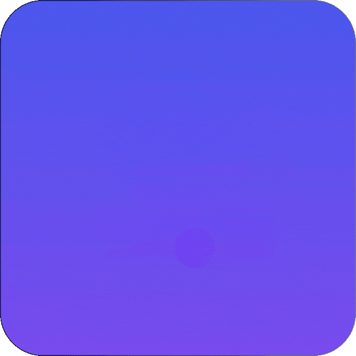

<h1 align="center">Hi 👋, I'm Mariam Badr</h1>

  

  

---

## 🚀 Current Projects I’ve Worked On

|  |  |  |  |  |
|:---:|:---:|:---:|:---:|:---:|
| **CinemaX App** | **Yaqeen App** | **News Plus App** | **Marketly App** | **Learnio App** |

---

## 👩‍💻 About Me

💙 Flutter Mobile App Developer focused on building clean, scalable, and high Quality applications. 
🏗️ Experienced with Clean Architecture and multiple State Management solutions. 
🔭 Currently working on a <a href="https://github.com/m9m6/safar_maei.git"><b>Ride Booking App</b></a>. 
📫 Reach me at <b>mariamalaabdr@gmail.com</b> 
🌱 Always learning, improving, and exploring new technologies. 

---

## 🛠️ Technologies & Tools

  
  
  
  
  
  
  
  
  
  
  
  
  
  
  
  
  

---

## 📊 GitHub Stats

  

---

## 🚀 Quote I Live By 
 <i>“The best way to learn is to build.”</i> 

---

## 📬 Contact Me

  
  &nbsp;&nbsp;
  
  &nbsp;&nbsp;
  
  &nbsp;&nbsp;
  

